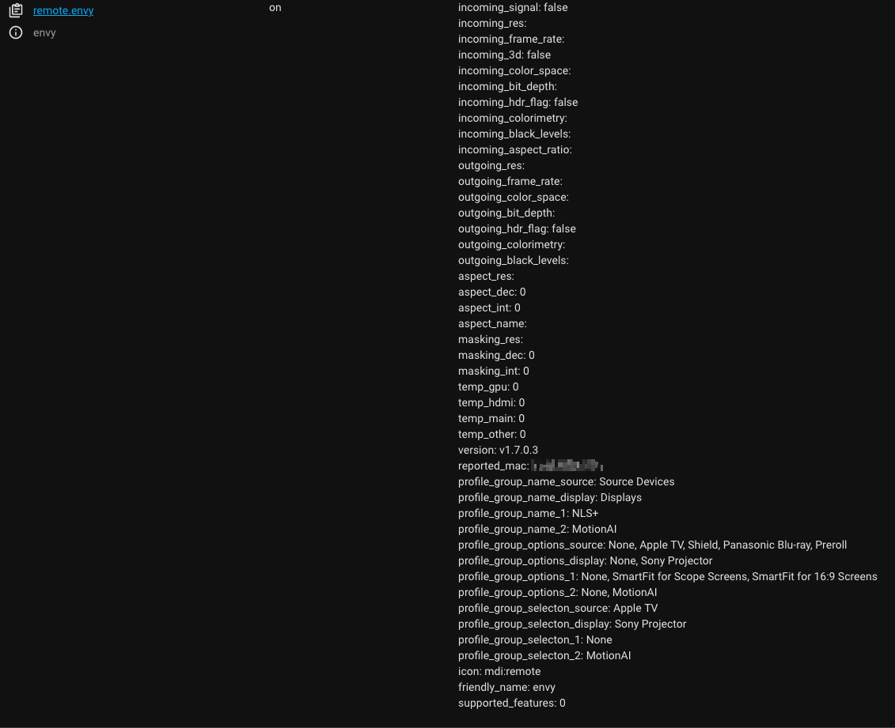

# hass-madvr-envy
A [Home Assistant](https://www.home-assistant.io/) custom component for interacting with a [MadVR Envy](https://madvrenvy.com/) video processor

Thanks to [iloveicedgreentea](https://github.com/iloveicedgreentea/madvr-envy-homeassistant) for the inspiration. I wanted some additional functionality (described below) and cleaner log files, so I started with an attempt to Fork and submit a PR until I realized that would involve seperate projects (the python library and the custom component) and more complexity than I was ready to take on. So instead I created this separate custom component. Use whichever suits your needs better.

## Features
- Asynchronous updates from Envy to Home Assistant, no polling.
- Lots and lots of attributes for your automations
- Power on (WOL), Power off, standby
- Emulated remote keys
- Profiles: Current values AND arrays of choices
- Anything and everything available to the [control protocol](https://madvrenvy.com/wp-content/uploads/EnvyIpControl.pdf?r=112a)



## Manual Installation

Copy the `custom_components/madvr-envy` directory to your `custom_components` folder. Modify your `configuration.yaml` as below and restart Home Assistant.

```yaml
remote:
  - platform: madvr-envy
    name: envy
    host: {{{The IP address of your Envy (required)}}}
    mac: {{{The MAC address of your Envy (required for WOL power on)}}}
```

A note about the `mac:` property: This can be in the form `xx:xx:xx:xx:xx:xx` or `xx-xx-xx-xx-xx-xx` or even `xxxxxxxxxxxx` any should work. Also, the custom component reads the MAC address of your Envy whenever it connects over IP. If the MAC you supplied in the `configuration.yaml` file doesn't match you'll see a warning in your Home Assistant log file.

If you're familiar with the component from [iloveicedgreentea](https://github.com/iloveicedgreentea/madvr-envy-homeassistant) then you may be asking why there's no `scan_interval:` setting in the configuration. This component dosent poll for data from the Envy, for better performance, it receives its data from the Envy Asynchronously.

## How I use this...
Examples are on the way.

